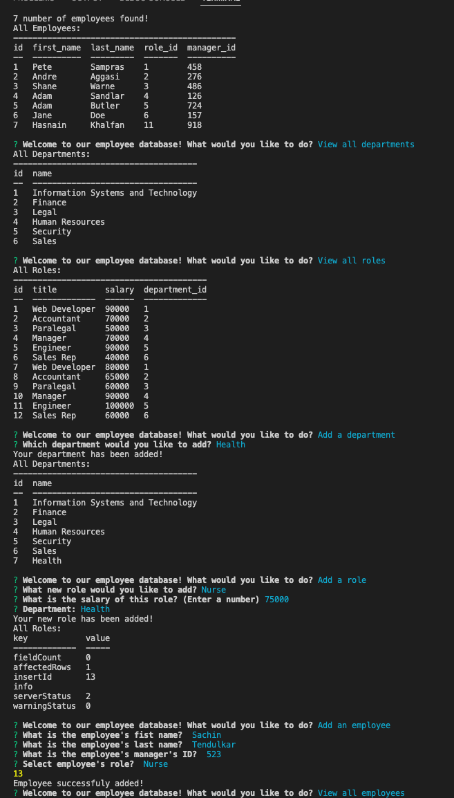

# Employee Tracker

---

## Description

This is a CLI command-line application to manage a company's employee database, using Node.js, Inquirer, and MySQL2.

---

## Table of Contents

- [Technology Used](#technology-used)

- [Links](#links)

- [Screenshots](#screenshots)

- [Usage](#usage)

- [Questions](#questions)

- [License](#license)

---

## Technology and Packages Used

- [Node.js](https://nodejs.org/en/)
- [GitHub](https://www.github.com)
- [MYSQL2]
- [Inquirer]
- [console.table]

---

## Links

- [GitHub Repository](https://github.com/hkhalfan1979/employee-tracker)

---

## Screenshots

### Video

### GIF

### Screengrab

---

## Usage

This application will allow users to view, add, and edit employees, roles, departments, and managers.

Walk through video [Watch the video](https://drive.google.com/file/d/1A3r2IJ30XHSe4ZmwvIG0v3xvIqqWfVis/view?usp=sharing)

---

## Questions

If you have any questions about the repo you can open an issue.

Hasnain Khalfan [Email](hkhalfan@gmail.com)
Github [Github](https://github.com/hkhalfan1979/)

---

## License

This project is licensed under the [MIT License](https://choosealicense.com/licenses/mit).

---

